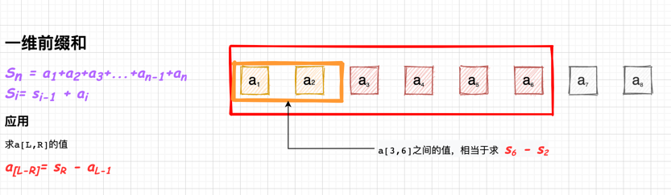
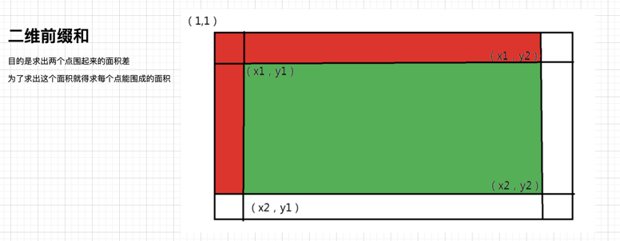

import useBaseUrl from "@docusaurus/useBaseUrl";

:::caution

The description in this article is not rigorous

:::

This article mainly records how to deal with prefix sum

<!--truncate-->

## Algorithm Thought
This algorithm is applicable to the sum of a continuous interval.

### One-dimensional prefix sum

```cpp
#include "iostream"
using namespace std;
const int N = 1e6+10;
int a[N];

int main(){

	int n; cin >> n;
	int res = 0;
	for(int i = 1; i <= n; i++){
		scanf("%d",&a[i]);
	}
	int s[n];
	s[0] = 0;
	for(int i = 1; i <= n; i++){
		s[i] = s[i-1] + a[i];
	}
	int m, l, r;
	while(m--){
		scanf("%d%d",&l, &r);
		res = s[r] - s[l-1];
		cout << res;
	}

	return 0;
}
```

### Two-dimensional prefix sum
:::info

You need to consider the edge such as `(x1,y1)-(x2,y1)` and `(x1,y1)-(x1,y2)` and `(x1,y1)` needn't be considered ~

:::


```cpp
#include "iostream"

using namespace std;
int arr[1010][1010];
int s[1010][1010];

int main(){

	int n, m, q,res;
	int x1,x2,y1,y2;
	scanf("%d%d%d",&n,&m,&q);
	for(int i = 1;i <= n; i++){
		for(int j = 1; j <= m; j++){
			scanf("%d",&arr[i][j]);
		}
	}
	for(int i = 1; i <= n; i++){
		for(int j = 1; j <= m; j++){
			s[i][j] = s[i-1][j]+s[i][j-1]-s[i-1][j-1]+arr[i][j];
		}
	}

	while(q--){
		scanf("%d%d%d%d",&x1,&y1,&x2,&y2);
		res = s[x2][y2] - s[x1-1][y2] - s[x2][y1-1] + s[x1-1][y1-1];
		printf("%d",res);
	}
	return 0;
}
```