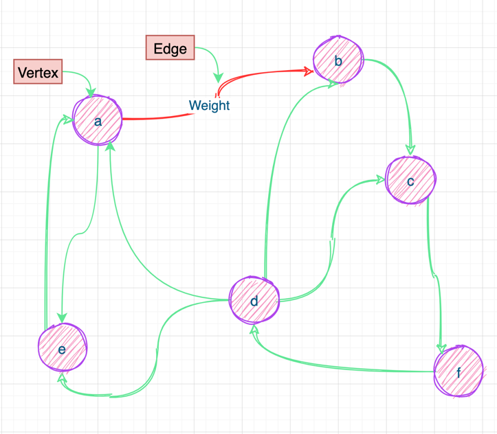

Graph is a structure that describes many-to-many relationships between data
<!-- truncate -->
:::caution

The code int this article is untested and must be debugged locally 

:::

## Representation of Graph
Graph is like that:



Here's two standard way to represent a graph `G = (V, E)`
- a collection of adjacency list
- a adjacency matrix

## 存储结构
:::info

graph is based on **adjacency list**

:::
```cpp
//edge of graph
typedef struct ENode * PtrToENode;
struct ENode{
Vertex V1;
Vertex V2;
WeightType weight;
};
typedef PtrToENode Edge;
```
```
//adjacency node
typedef struct AdjNode * PtrToAdjNode;
typedef struct AdjNode {
Vertex V;
WeightType Weight;
PtrToAdjNode nextNode;
}AdjNode;
```
```
//adjacency vertex node , it's a root node which represent vertex
typedef struct VNode * PtrToVNode;
typedef struct VNode{
DataType data;
PtrToAdjNode FirstNode;
}AdjList[MaxVertexNum];
```
```
//graph,it contains number of vertex and edge and a adjlist
typedef struct GNode * PtrToGNode;
struct GNode{
int Nv;
int Ne;
AdjList G;
};
typedef PtrToGNode Graph;
```

## 基本运算集
```
//create graph based on adjacency-list without edge
void CreateGraph(Graph &graph){
int Nv, Ne;
graph = (Graph)malloc(sizeof(struct GNode));
scanf("%d %d",&graph->Nv, &graph->Ne);
for(int i = 0; i < graph->Nv; i++){
graph->G[i].FirstNode = NULL;
}
}
```

```
//insert edge just action
void InsertEdge(Graph &graph, Edge e){

	PtrToAdjNode NewNode;
	
	NewNode = (PtrToAdjNode)malloc(sizeof(e->V2));
	NewNode->V = e->V2;
	NewNode->nextNode = graph->G[e->V1].FirstNode;
	graph->G[e->V1].FirstNode = NewNode;

}
```

```
//build graph
void BuildGraph(Graph &graph){
PtrToENode e;
CreateGraph(graph);
int Ne = graph->Ne;
while(Ne--){
e = (PtrToENode)malloc(sizeof(struct ENode));
scanf("%d %d %d",&e->V1,&e->V2,&e->weight);
InsertEdge(graph, e);
}
}
```
```
//display graph
void DisGraph(Graph graph){
for(int i = 0; i < graph->Nv; i++){
PtrToAdjNode node = graph->G[i].FirstNode;
printf("顶点%d的邻接点为: ",i);
while(node != NULL){
printf("%d ",node->V);
node = node->nextNode;
}
printf("\n");
}
}
```

